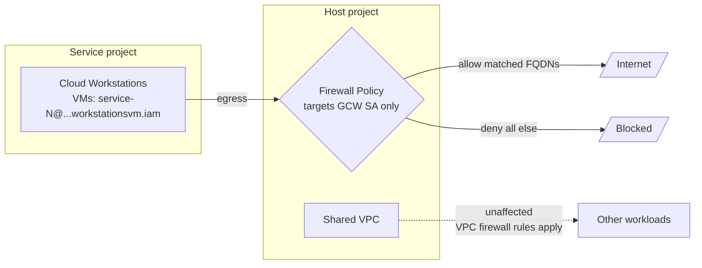

# FQDN-Based Egress Filtering for Google Cloud Workstations

> Enforce domain-level egress allow lists on Cloud Workstations using Cloud NGFW Standard tier.
> Tested and verified with OpenTofu. Full infrastructure-as-code included.

| | |
|---|---|
| **What** | Egress firewall policy with FQDN allow list + default deny |
| **Where** | [Google Cloud Workstations](https://cloud.google.com/workstations) on a [Shared VPC](https://cloud.google.com/vpc/docs/shared-vpc) |
| **Tier** | [Cloud NGFW Standard](https://docs.cloud.google.com/firewall/docs/ngfw_tiers) (no Enterprise needed) |
| **Tooling** | OpenTofu / Terraform with `google` + `google-beta` providers |
| **Projects** | Host project (VPC + firewall policy) + Service project (workstations) |

<details>
<summary>Table of contents</summary>

- [Architecture](#architecture)
- [Quick Start](#quick-start)
- [Allow List Format](#allow-list-format)
- [External Allow Lists](#external-allow-lists)
- [Test Results](#test-results)
- [Trade-Offs](#trade-offs)
- [Security Considerations](#security-considerations)
- [NGFW Tier Comparison](#ngfw-tier-comparison)
- [Shared VPC](#shared-vpc)
- [How It Works](#how-it-works)
- [Audit Mode](#audit-mode)
- [Prerequisites](#prerequisites)
- [Implementation Details](#implementation-details)
- [Resources Created](#resources-created)
- [Cost](#cost)
- [Cleanup](#cleanup)
- [Lessons Learned](#lessons-learned)
- [References](#references)

</details>

## Architecture



## Quick Start

```bash
cd terraform
cp terraform.example.tfvars terraform.tfvars
# Edit terraform.tfvars with your host and service project IDs
tofu init
tofu plan
tofu apply
```

Customise the allow lists by editing `allowed-hosts.txt` (FQDNs) and `allowed-cidrs.txt` (IP ranges). Each line takes the format `<value> <ports> [# comment]`:

```
# allowed-hosts.txt
#                                  ports
google.com      *                  # Search engine — all ports
github.com      443                # Source control — HTTPS only
api.partner.com 80,443             # Partner API — HTTP + HTTPS
```

```
# allowed-cidrs.txt
#                                  ports
10.0.0.0/8       *                 # Internal corporate network — all ports
-10.1.0.0/16     *                 # EXCEPT this subnet (deny, wins over allow)
203.0.113.0/24   443               # Partner API — HTTPS only
198.51.100.0/24  8000-9000         # App tier — port range
```

Port specs:

| Format | Meaning |
|--------|---------|
| `*` | All TCP ports (0–65535) |
| `443` | Single port |
| `80,443` | Comma-separated ports |
| `8000-9000` | Port range |
| `80,443,8000-9000` | Combination |

CIDR exclusions: prefix a CIDR with `-` in `allowed-cidrs.txt` to create a deny rule at a lower priority number, so it overrides any broader allow. Use to carve holes out of wide ranges.

Lines without a port spec are silently dropped. Run the linter to catch mistakes:

```bash
nix-shell -p python3 --run "python3 lint_allowlists.py"
```

Or override at apply time (note: variable overrides get `*` / all ports; per-entry port specs are only supported in the files):

```bash
cd terraform
tofu apply \
  -var="host_project_id=YOUR_HOST_PROJECT_ID" \
  -var="service_project_id=YOUR_SERVICE_PROJECT_ID" \
  -var="service_project_num=YOUR_SERVICE_PROJECT_NUMBER" \
  -var='allowed_fqdns=["google.com","github.com","api.internal"]' \
  -var='allowed_cidrs=["10.0.0.0/8","203.0.113.0/24"]'
```

## Allow List Format

Both `allowed-hosts.txt` and `allowed-cidrs.txt` use the same line format:

```
<value> <ports> [# comment]
```

### Fields

| Field | Required | Description |
|-------|----------|-------------|
| `value` | Yes | FQDN (hosts file) or CIDR range (cidrs file). CIDR file only: prefix with `-` to create a deny (exclusion) rule. |
| `ports` | Yes | TCP port spec. Lines without it are silently dropped. |
| `# comment` | No | Inline comment. Everything from `#` onward is stripped. |

### Port Specs

| Format | Meaning |
|--------|---------|
| `*` | All TCP ports (0–65535) |
| `443` | Single port |
| `80,443` | Comma-separated ports |
| `8000-9000` | Port range |
| `80,443,8000-9000` | Combination |

Entries sharing the same port spec are grouped into a single firewall rule. For example, five FQDNs all on port `443` produce one rule; adding an FQDN on `80,443` creates a second rule.

### CIDR Exclusions

In `allowed-cidrs.txt`, prefix a CIDR with `-` to deny traffic to it. Deny rules get lower priority numbers than allow rules, so they always evaluate first:

```
10.0.0.0/8      *          # Allow all of 10.0.0.0/8
-10.1.0.0/16    *          # Block 10.1.0.0/16 (wins over the allow above)
-10.2.0.0/16    443        # Block HTTPS to 10.2.0.0/16 only
```

This effectively implements "CIDR minus CIDR": allow a broad range, carve out exceptions.

### Linter

Terraform silently drops lines that don't have a port spec, and doesn't validate hostname or CIDR syntax until apply time. The linter catches these early:

```bash
nix-shell -p python3 --run "python3 lint_allowlists.py"
```

Checks: missing port specs, invalid hostnames, invalid CIDRs, wildcard hostnames (`*.example.com`), port ranges out of bounds or reversed, duplicate/overlapping ports in a spec, host bits in CIDRs, duplicate entries, orphan CIDR exclusions, redundant overlapping CIDR allows. Exits non-zero on errors.

### External Allow Lists

To maintain allow lists in a separate repository (shared across teams, managed by security, etc.):

**Git submodule (recommended):**

```bash
# From the repo root:
git submodule add https://github.com/your-org/allowlists.git external-allowlists
git submodule update --init --recursive
```

Then point Terraform at it:

```hcl
# terraform.tfvars
allowlist_dir = "external-allowlists"
```

The path is relative to the `terraform/` directory. The external repo must contain `allowed-hosts.txt` and `allowed-cidrs.txt` in the same format.

**Absolute path:**

```hcl
allowlist_dir = "/etc/ngfw/allowlists"
```

**Variable overrides (all ports, no per-entry control):**

Setting `allowed_fqdns` or `allowed_cidrs` takes precedence over both local files and `allowlist_dir`.

To lint external files:

```bash
nix-shell -p python3 --run "python3 lint_allowlists.py external-allowlists/allowed-hosts.txt external-allowlists/allowed-cidrs.txt"
```

---

## Test Results

Verified on host project `dave-test-456412` + service project `dave-test-svc` / `europe-west2` against a live Cloud Workstation:

| Target | Policy | Result |
|--------|--------|--------|
| `google.com` | Allowed (FQDN match) | HTTP 301 / 0.07s |
| `github.com` | Allowed (FQDN match) | HTTP 200 / 0.09s |
| `facebook.com` | Blocked (default deny) | Timeout / exit 28 |
| `reddit.com` | Blocked (default deny) | Timeout / exit 28 |

---

## Trade-Offs

### Advantages

- No appliances, VMs, or proxies to manage. [Cloud NGFW is built into the VPC fabric](https://docs.cloud.google.com/firewall/docs/ngfw_tiers).
- Domains resolve to IPs automatically. When a service changes addresses, the firewall updates without intervention.
- One policy can attach to multiple VPCs for organisation-wide consistency.
- Full infrastructure-as-code via OpenTofu/Terraform.
- Private/internal domains work through [Cloud DNS private zones](https://docs.cloud.google.com/firewall/docs/fqdn-objects-overview#fqdn-resolution).
- Available on the Standard tier. No Enterprise license needed.
- No patching, no capacity planning, no scaling concerns.

### Drawbacks

- No wildcards. Every domain must be listed explicitly (`*.googleapis.com` is [not supported](https://docs.cloud.google.com/firewall/docs/fqdn-objects-overview#restrictions)).
- DNS-dependent. If DNS egress is blocked, FQDN rules silently stop working.
- Periodic resolution, not real-time. There is a lag window when IPs change.
- Domain-level only (L3/L4). Cannot filter by URL path. [Enterprise + TLS inspection](https://docs.cloud.google.com/firewall/docs/ngfw_tiers) is needed for that.
- No deep packet inspection, intrusion detection, or malware scanning on Standard.
- Workstations get stuck in `STATE_STARTING` if the deny rule blocks the [GCW control plane](https://docs.cloud.google.com/workstations/docs/configure-firewall-rules) before allow rules are in place.
- Outbound DNS server policies (forwarding to on-prem) can break FQDN resolution for internal domains.

---

## Security Considerations

### DNS Trust Boundary

FQDN-based filtering shifts the trust boundary from the network layer to the DNS layer. [Cloud NGFW resolves FQDNs to IP addresses](https://docs.cloud.google.com/firewall/docs/fqdn-objects-overview#how-fqdn-objects-work) and enforces rules against those IPs, but it has no way to validate that a resolved IP legitimately belongs to the domain. It trusts whatever DNS returns.

This is the primary risk with this approach. Three attack vectors:

**DNS spoofing on internal resolvers.** If an attacker gains access to a Cloud DNS private zone, an internal DNS server, or any resolver in the VPC's name resolution path, they can return a malicious IP for an allowed domain. If `api.partner.com` is on the allow list and the attacker poisons its response to resolve to their IP, the firewall allows traffic to that IP.

**Split-horizon DNS inconsistencies.** If the firewall and workstations use different resolution paths (e.g. Cloud DNS vs on-prem forwarding), the allow rule may match different IPs than what the workstation actually connects to, causing false allows or false blocks.

**On-prem DNS forwarding.** If the VPC forwards queries to on-prem DNS over VPN or Interconnect, any compromise in that chain (resolver, server, network path) allows bypassing the allow list.

<details>
<summary>Mitigations table</summary>

| Risk | Mitigation |
|------|------------|
| DNS spoofing of allowed domains | Restrict `dns.changes.create` on private zones via IAM. Audit changes via Cloud Audit Logs. |
| Compromised on-prem DNS | Avoid forwarding to on-prem resolvers. Use Cloud DNS private zones as the sole source of truth. |
| Split-horizon mismatches | Keep the VPC name resolution order identical for firewall and workstations. Do not mix Cloud DNS and forwarding policies. |
| Stale poisoned records | Enable Cloud DNS DNSSEC on public zones. Monitor private zones for unexpected record changes. |
| Lateral movement via DNS | Combine FQDN rules with IP range restrictions. Allow `api.partner.com` on TCP 443 only, not all ports. |

</details>

### Direct IP Connections

[FQDN rules](https://docs.cloud.google.com/firewall/docs/fqdn-objects-overview#how-fqdn-objects-work) only match traffic where the destination IP was resolved from the specified domain. A direct connection to an IP (bypassing DNS) is not caught by FQDN rules.

This is a security benefit: an attacker who knows the IP behind an allowed domain cannot bypass the rule by connecting directly. The default deny catches it.

It can also be a surprise: an application hardcoded to an IP address will be denied, even if that IP belongs to an allowed domain. There is no reverse-DNS lookup.

A single rule [cannot mix](https://docs.cloud.google.com/firewall/docs/fqdn-objects-overview#restrictions) `dest_fqdns` and `dest_ip_ranges`. Create separate rules:

```hcl
resource "google_compute_network_firewall_policy_rule" "allow_api_domain" {
  priority                = 1000
  action                  = "allow"
  direction               = "EGRESS"
  target_service_accounts = [local.gcw_vm_sa]
  match {
    dest_fqdns = ["api.partner.com"]
    layer4_configs { ip_protocol = "tcp" ports = ["443"] }
  }
}

resource "google_compute_network_firewall_policy_rule" "allow_api_ip" {
  priority                = 1001
  action                  = "allow"
  direction               = "EGRESS"
  target_service_accounts = [local.gcw_vm_sa]
  match {
    dest_ip_ranges = ["203.0.113.0/24"]
    layer4_configs { ip_protocol = "tcp" ports = ["443"] }
  }
}
```

Use FQDN rules for external services with domain names. Use IP/CIDR rules only for destinations that have no domain (peered networks, Google restricted VIPs). Always pair with a default deny.

---

## NGFW Tier Comparison

This project uses the **Standard** tier. Enterprise is not required for FQDN-based allow lists. See the [Cloud NGFW tiers documentation](https://docs.cloud.google.com/firewall/docs/ngfw_tiers) for the full comparison.

| Feature | Essentials | Standard | Enterprise |
|---------|-----------|----------|------------|
| Stateful inspection (L3/L4) | Yes | Yes | Yes |
| Secure tags | Yes | Yes | Yes |
| Address groups | Yes | Yes | Yes |
| VPC firewall rules | Yes | Yes | Yes |
| FQDN objects | | Yes | Yes |
| Geolocation objects | | Yes | Yes |
| Google Threat Intelligence | | Yes | Yes |
| Intrusion Detection & Prevention (IDPS) | | | Yes |
| URL filtering | | | Yes |
| TLS inspection | | | Yes |

Enterprise adds three capabilities (see [Cloud NGFW tiers](https://docs.cloud.google.com/firewall/docs/ngfw_tiers) for the full breakdown):

1. **IDPS** (powered by Palo Alto Networks). Signature-based detection of malware, spyware, C2 patterns, and known exploits. Runs in alert-only or block mode.

2. **URL filtering**. L7 filtering of specific URL paths, not just domains. Allow `github.com/org/repo` while blocking `github.com/org/repo/wiki`. Requires TLS inspection.

3. **TLS inspection**. Decrypts, inspects, and re-encrypts traffic. Requires a CA certificate and firewall endpoints.

Enterprise is warranted when: you need to block specific URL paths within a domain, require IDS/IPS against known threats, have compliance mandates for deep packet inspection, or need to inspect east-west traffic between VMs.

Standard is sufficient when: you need domain-level allow/deny lists (this project), want geolocation filtering, want Google Threat Intelligence IP blocklists, and do not need to inspect encrypted payloads.

---

## Shared VPC

This project uses a [Shared VPC](https://cloud.google.com/vpc/docs/shared-vpc) architecture. The VPC and firewall policy live in a host project. Cloud Workstations run in a separate service project. Firewall rules target the GCW VM service account so that only workstation VMs are affected by the egress restrictions.

### Which Service Account Do GCW VMs Use?

Cloud Workstations creates [two service accounts](https://cloud.google.com/workstations/docs/service-accounts) per project:

| Account | Format | Purpose |
|---------|--------|---------|
| Service Agent | `service-NUM@gcp-sa-workstations.iam` | Manages compute/network resources on your behalf |
| VM Default SA | `service-NUM@gcp-sa-workstationsvm.iam` | Attached to workstation VM instances when no custom SA is specified |

The VM Default Service Account is the one targeted in firewall rules. It is the identity the underlying Compute Engine instance runs as.

You can also specify a custom service account in the workstation config (`service_account` field in the `gce_instance` block). If you do, target that instead. Custom service accounts are recommended because the [VM Default SA has limitations](https://cloud.google.com/workstations/docs/service-accounts): no container logging, no SA impersonation, no SSH.

### Prerequisites for Shared VPC

1. The host project must be [enabled as a Shared VPC host](https://cloud.google.com/compute/docs/shared-vpc/enabling) (`roles/compute.xpnAdmin` at the org level)
2. The service project must be [attached to the host project](https://cloud.google.com/compute/docs/shared-vpc/add-service-project)
3. The GCW Service Agent needs `roles/compute.networkUser` on the subnet in the host project
4. The GCW VM Default SA needs `roles/compute.networkUser` on the subnet in the host project
5. The GCW Service Agent needs `roles/workstations.serviceAgent` on both host and service projects

The OpenTofu code handles items 2-5 automatically. Item 1 requires org-level permissions.

### IAM Setup

The OpenTofu code grants the following IAM bindings:

| Role | Scope | Member | Purpose |
|------|-------|--------|---------|
| `roles/compute.networkUser` | Subnet (host project) | GCW Service Agent SA | Network access for workstation management |
| `roles/compute.networkUser` | Subnet (host project) | GCW VM Default SA | Network access for workstation VMs |
| `roles/workstations.serviceAgent` | Host project | GCW Service Agent SA | Allows config validation and VM provisioning |
| `roles/workstations.serviceAgent` | Service project | GCW Service Agent SA | Same, on the service project |

See [Set up Shared VPC access](https://cloud.google.com/workstations/docs/set-up-shared-vpc-access) for the full procedure.

```hcl
resource "google_compute_subnetwork_iam_member" "gcw_agent_network_user" {
  provider   = google.host
  subnetwork = google_compute_subnetwork.subnet.name
  role       = "roles/compute.networkUser"
  member     = "serviceAccount:${local.gcw_agent_sa}"
}

resource "google_compute_subnetwork_iam_member" "gcw_vm_network_user" {
  provider   = google.host
  subnetwork = google_compute_subnetwork.subnet.name
  role       = "roles/compute.networkUser"
  member     = "serviceAccount:${local.gcw_vm_sa}"
}

resource "google_project_iam_binding" "gcw_agent_service_agent_host" {
  project = var.host_project_id
  role    = "roles/workstations.serviceAgent"
  members = ["serviceAccount:${local.gcw_agent_sa}"]
}

resource "google_project_iam_binding" "gcw_agent_service_agent_svc" {
  project = var.service_project_id
  role    = "roles/workstations.serviceAgent"
  members = ["serviceAccount:${local.gcw_agent_sa}"]
}
```

Use `iam_member` (not `iam_binding`) for subnet roles when multiple service accounts need the same role. Authoritative bindings overwrite each other on apply.

### Alternative: Secure Tags

If service account targeting is too rigid (e.g. multiple projects share the same SA, or SA changes are frequent), use [secure tags](https://docs.cloud.google.com/firewall/docs/tags-firewalls-overview) instead:

1. Create a tag key and value in the organisation (e.g. `workstation: restricted-egress`)
2. Bind the tag to GCW VMs via the workstation config
3. Use `target_secure_tags` in firewall rules instead of `target_service_accounts`

Secure tags have IAM controls, so only authorised users can assign or remove them. This prevents a developer from untagging their workstation to bypass the rules.

### Why Not Network Tags?

Cloud Workstations lets you assign network tags to workstation VMs via the `tags` field in the `gce_instance` config block. These are standard GCE network tags. They work with traditional VPC firewall rules (`google_compute_firewall`).

But FQDN-based rules live in a [network firewall policy](https://docs.cloud.google.com/firewall/docs/network-firewall-policies) (`google_compute_network_firewall_policy`), not in VPC firewall rules. Network firewall policies [do not support network tags](https://docs.cloud.google.com/firewall/docs/tags-firewalls-overview#comparison_of_secure_tags_and_network_tags) as a targeting method. This is a hard limitation of the API.

| Targeting method | VPC firewall rules | Network firewall policies (FQDN rules) |
|---|---|---|
| Network tags | Yes | No |
| Service accounts | Yes | Yes |
| Secure tags | No | Yes |

This means network tags cannot be used to scope FQDN egress rules to specific VMs on a Shared VPC. Use service accounts or secure tags instead.

---

## How It Works

### Firewall Rules

1. Create a [network firewall policy](https://docs.cloud.google.com/firewall/docs/network-firewall-policies) (global, regional, or hierarchical)
2. Add rules referencing FQDNs as destinations
3. [Cloud NGFW periodically resolves](https://docs.cloud.google.com/firewall/docs/fqdn-objects-overview#how-fqdn-objects-work) the FQDNs using the VPC's DNS resolution order
4. Resolved IPs are used to enforce the rule
5. The policy is associated with a VPC

### Rule Priority

Lower number = higher precedence. [This trips people up](https://docs.cloud.google.com/firewall/docs/firewall-policies-overview#rule_evaluation).

All rules target the GCW VM service account (`target_service_accounts`). Only workstation VMs are affected by these rules. Other VMs on the Shared VPC keep their existing egress behaviour.

| Priority | Action | Match | Purpose |
|----------|--------|-------|---------|
| 998 | ALLOW | `pkg.dev`, `gcr.io` TCP 80,443 | Container image pulls (Artifact Registry / GCR) |
| 999 | ALLOW | `googleapis.com` TCP 443 | Google API access |
| 1001 | ALLOW | `0.0.0.0/0` TCP/UDP 53 | DNS resolution |
| 1050 | ALLOW | `199.36.153.4/30`, `199.36.153.8/30` TCP 80,443 | Google restricted + private VIPs |
| 1100 | ALLOW | `cloudworkstations.dev` TCP 443,980 | GCW control plane (FQDN) |
| 1101 | ALLOW | GCW cluster control plane IP TCP 80,443,980 | GCW control plane (internal IP) |
| 1200+ | ALLOW | user-specified FQDNs TCP (per-entry ports) | Allow list (domains) — one rule per unique port spec |
| 2000+ | DENY | user-specified CIDR exclusions TCP (per-entry ports) | CIDR deny list — lower priority than allows |
| 2100+ | ALLOW | user-specified CIDRs TCP (per-entry ports) | Allow list (IP ranges) — one rule per unique port spec |
| 65533 | ALLOW | `0.0.0.0/0` all | **Audit mode only** — logs unmatched traffic, lets it through |
| 65534 | DENY | `0.0.0.0/0` all | Default deny |

Rules are grouped by port spec: entries sharing the same port spec (e.g. all `443` entries) become a single firewall rule. CIDR deny rules (`-` prefix) get priority numbers below the CIDR allow rules so exclusions always win.

If the deny rule gets a lower priority number than the allow rules, it evaluates first and blocks everything. The deny rule must always have the highest priority number.

### Audit Mode

The `firewall_mode` variable controls whether unmatched traffic is blocked or allowed with logging:

| Mode | Behaviour | Use case |
|------|-----------|----------|
| `enforce` (default) | Default deny blocks unmatched traffic | Production |
| `audit` | All traffic allowed; logging enabled on every rule so you can see what would be blocked | Testing before enforcement |

In audit mode, a catch-all allow rule at priority 65533 (just above the default deny at 65534) matches everything the allow rules didn't catch. It logs each connection, then lets it through. The default deny never fires. This lets you observe real traffic patterns before turning on enforcement.

```bash
# Preview what would be blocked:
tofu apply -var="firewall_mode=audit"

# Check Cloud Logging for the audit_allow_all rule to see unmatched traffic,
# then switch to enforcement:
tofu apply -var="firewall_mode=enforce"
```

### DNS Resolution

Cloud NGFW resolves FQDNs via the VPC's name resolution order. [Supported sources](https://docs.cloud.google.com/firewall/docs/fqdn-objects-overview#fqdn-resolution):

- Cloud DNS public zones
- Cloud DNS private zones (for internal/private TLDs)
- Cloud DNS response policies
- Compute Engine internal DNS names

Internal domains (`app.internal`, `service.corp`) work when defined in a Cloud DNS private zone associated with the VPC. If the VPC uses an outbound server policy pointing to an alternative resolver (on-prem forwarding), resolution may break.

### GCW Dependencies

[Cloud Workstations will not start](https://docs.cloud.google.com/workstations/docs/configure-firewall-rules) if these egress paths are blocked:

| Dependency | Protocol | Why |
|------------|----------|-----|
| DNS | TCP/UDP 53 | Name resolution |
| `cloudworkstations.dev` | TCP 443, 980 | Control plane (FQDN) |
| Cluster control plane IP | TCP 80, 443, 980 | Control plane (internal, cluster-allocated) |
| `googleapis.com` | TCP 443 | Google APIs |
| `pkg.dev`, `gcr.io` | TCP 80, 443 | Container image pulls from Artifact Registry / GCR |
| Google restricted + private VIPs | TCP 80, 443 | Private Google Access for Google APIs and services |
| [Private Google Access](https://docs.cloud.google.com/vpc/docs/configure-private-google-access) | | Must be enabled on the subnet |
| Service Networking peering | | VPC peering to Google-managed services |
| `roles/workstations.serviceAgent` | IAM | GCW Service Agent needs this on both host and service projects |

The control plane IP (e.g. `10.0.0.7`) is allocated by the cluster from the subnet range. The firewall rule reads it dynamically from the cluster resource via `local.gcw_control_plane_ip`.

---

## Prerequisites

<details>
<summary>APIs</summary>

```
compute.googleapis.com           # Firewall policies + FQDN objects
workstations.googleapis.com      # Cloud Workstations
servicenetworking.googleapis.com # Private services access for GCW
```

Only the Compute Engine API is needed for FQDN objects. No Network Security API or Enterprise tier required.

</details>

<details>
<summary>IAM roles</summary>

Host project:
- `roles/compute.securityAdmin` to create firewall policies
- `roles/compute.networkAdmin` to create VPCs and subnets
- `roles/serviceusage.serviceUsageAdmin` to enable APIs

Service project:
- `roles/workstations.admin` to create workstation clusters/configs
- `roles/serviceusage.serviceUsageAdmin` to enable APIs

Organisation level:
- `roles/compute.xpnAdmin` to enable Shared VPC and attach service projects

</details>

<details>
<summary>Private Services Access</summary>

Cloud Workstations require VPC peering to Google-managed services. A `/24` IP range must be allocated and peered via Service Networking. The OpenTofu code handles this automatically (`network.tf`).

</details>

---

## Implementation Details

### File Structure

```
README.md                          This file
allowed-hosts.txt                  FQDN allow list (value + ports per line, # comments)
allowed-cidrs.txt                  IP CIDR allow list (value + ports per line, - prefix for exclusions)
lint_allowlists.py                 Validates allow list syntax (ports, hostnames, CIDRs, exclusions)
terraform/
  providers.tf                     Provider config: google.host, google.svc, google-beta.svc
  variables.tf                     Input variables + locals (allow list parser, port-spec grouping)
  terraform.example.tfvars         Copy to terraform.tfvars and fill in
  main.tf                          API enablement (host + service projects)
  network.tf                       VPC, subnet, Shared VPC, IAM bindings, service networking
  firewall.tf                      Firewall policy, FQDN/CIDR rules (for_each per port spec), default deny
  workstation.tf                   Cluster, config, workstation instance (service project)
  outputs.tf                       VPC name, workstation host, policy name, GCW SA
```

### Three Provider Configs

Network and firewall resources run in the host project. Workstation resources run in the service project. Cloud Workstations resources (`google_workstations_*`) are only in the `google-beta` provider under OpenTofu.

```hcl
required_providers {
  google      = { source = "hashicorp/google",      version = "~> 6.0" }
  google-beta = { source  = "hashicorp/google-beta", version = "~> 6.0" }
}

provider "google"      { alias = "host"; project = var.host_project_id }
provider "google"      { alias = "svc";  project = var.service_project_id }
provider "google-beta" { alias = "svc";  project = var.service_project_id }
```

Host resources use `provider = google.host`. Workstation resources use `provider = google-beta.svc`. The workstation cluster references the Shared VPC network and subnet via their full project-relative paths.

<details>
<summary>Importing existing resources</summary>

If resources were created via gcloud or console, run these from the `terraform/` directory. Replace `HOST` and `SVC` with your project IDs.

```bash
# APIs
tofu import google_project_service.host_compute HOST/compute.googleapis.com
tofu import google_project_service.host_servicenetworking HOST/servicenetworking.googleapis.com
tofu import google_project_service.svc_compute SVC/compute.googleapis.com
tofu import google_project_service.svc_workstations SVC/workstations.googleapis.com

# Shared VPC
tofu import google_compute_shared_vpc_host_project.host HOST
tofu import google_compute_shared_vpc_service_project.svc HOST/SVC

# Network (host project)
tofu import google_compute_network.vpc projects/HOST/global/networks/ngfw-test-vpc
tofu import google_compute_subnetwork.subnet projects/HOST/regions/europe-west2/subnetworks/ngfw-test-subnet
tofu import google_compute_global_address.private_service_access \
  projects/HOST/global/addresses/google-managed-services-ngfw-test-subnet
tofu import google_service_networking_connection.private_vpc_connection \
  "projects/HOST/global/networks/ngfw-test-vpc:servicenetworking.googleapis.com"

# IAM bindings
tofu import google_compute_subnetwork_iam_member.gcw_agent_network_user \
  "projects/HOST/regions/europe-west2/subnetworks/ngfw-test-subnet roles/compute.networkUser serviceAccount:service-NUM@gcp-sa-workstations.iam.gserviceaccount.com"
tofu import google_compute_subnetwork_iam_member.gcw_vm_network_user \
  "projects/HOST/regions/europe-west2/subnetworks/ngfw-test-subnet roles/compute.networkUser serviceAccount:service-NUM@gcp-sa-workstationsvm.iam.gserviceaccount.com"
tofu import google_project_iam_binding.gcw_agent_service_agent_host \
  "HOST roles/workstations.serviceAgent"
tofu import google_project_iam_binding.gcw_agent_service_agent_svc \
  "SVC roles/workstations.serviceAgent"

# Firewall policy + rules (host project)
tofu import google_compute_network_firewall_policy.fqdn_policy \
  projects/HOST/global/firewallPolicies/fqdn-allow-policy
tofu import google_compute_network_firewall_policy_association.vpc_association \
  "projects/HOST/global/firewallPolicies/fqdn-allow-policy/associations/network-ngfw-test-vpc"

P="projects/HOST/global/firewallPolicies/fqdn-allow-policy/rules"
tofu import google_compute_network_firewall_policy_rule.allow_container_registry "$P/998"
tofu import google_compute_network_firewall_policy_rule.allow_googleapis "$P/999"
# FQDN rules use for_each keyed by port spec. Import one per group:
# tofu import 'google_compute_network_firewall_policy_rule.allow_fqdns["*"]' "$P/1200"
tofu import google_compute_network_firewall_policy_rule.allow_dns "$P/1001"
# CIDR deny rules (exclusions) — for_each keyed by port spec:
# tofu import 'google_compute_network_firewall_policy_rule.deny_cidrs["*"]' "$P/2000"
# CIDR allow rules — for_each keyed by port spec:
# tofu import 'google_compute_network_firewall_policy_rule.allow_cidrs["*"]' "$P/2100"
tofu import google_compute_network_firewall_policy_rule.allow_google_restricted_vip "$P/1050"
tofu import google_compute_network_firewall_policy_rule.allow_gcw_control_plane "$P/1100"
tofu import google_compute_network_firewall_policy_rule.allow_gcw_control_plane_ip "$P/1101"
tofu import google_compute_network_firewall_policy_rule.default_deny_egress "$P/65534"

# Workstations (service project)
tofu import google_workstations_workstation_cluster.cluster \
  "projects/SVC/locations/europe-west2/workstationClusters/ngfw-test-cluster"
tofu import google_workstations_workstation_config.config \
  "projects/SVC/locations/europe-west2/workstationClusters/ngfw-test-cluster/workstationConfigs/ngfw-test-config"
tofu import google_workstations_workstation.workstation \
  "projects/SVC/locations/europe-west2/workstationClusters/ngfw-test-cluster/workstationConfigs/ngfw-test-config/workstations/ngfw-test-ws"
```

Import pitfalls to watch for:

1. `google_compute_global_address` may have `address_type = "INTERNAL"` set on import but omitted in your Terraform. This triggers destroy/recreate. Add `address_type = "INTERNAL"` to the resource block.
2. The gcloud-created association uses the VPC name as its identifier (e.g. `network-ngfw-test-vpc`). The Terraform `name` must match exactly.
3. Import commands must run sequentially. Parallel imports hit state lock errors.
4. Shared VPC host enablement requires `roles/compute.xpnAdmin` at the org level. Import it after enabling manually.
5. GCW service agents do not exist until the Workstations API is activated. Enable it in the service project before importing IAM bindings.

</details>

---

## Resources Created

| Resource | Project | Name | Details |
|----------|---------|------|---------|
| Shared VPC Host | Host | `dave-test-456412` | XPN host enabled |
| Shared VPC Attachment | Host | `dave-test-svc` | Service project attached |
| VPC | Host | `ngfw-test-vpc` | Custom mode, 10.0.0.0/24 |
| Subnet | Host | `ngfw-test-subnet` | europe-west2, Private Google Access |
| Firewall Policy | Host | `fqdn-allow-policy` | Global, dynamic rules (per port-spec groups + CIDR exclusions), SA-targeted |
| Subnet IAM (Agent SA) | Host | | `compute.networkUser` for GCW Service Agent |
| Subnet IAM (VM SA) | Host | | `compute.networkUser` for GCW VM Default SA |
| Project IAM (Agent SA) | Host + Service | | `workstations.serviceAgent` for GCW Service Agent |
| Private IP Range | Host | `google-managed-services-ngfw-test-subnet` | /24 for service networking |
| VPC Peering | Host | `servicenetworking-googleapis-com` | Google-managed services |
| Workstation Cluster | Service | `ngfw-test-cluster` | europe-west2, Shared VPC |
| Workstation Config | Service | `ngfw-test-config` | e2-standard-4, Code-OSS, 200GB PD |
| Workstation | Service | `ngfw-test-ws` | Test instance |

## Cost

| Item | Cost |
|------|------|
| [Cloud NGFW Standard](https://docs.cloud.google.com/firewall/docs/ngfw_tiers) | ~$0.04/GB data processing |
| e2-standard-4 VM | ~$0.134/hour |
| 200GB pd-standard disk | ~$8.80/month |
| Cloud DNS private zone (optional) | $0.50/month per zone |

## Cleanup

```bash
cd terraform
# The firewall policy has prevent_destroy enabled. Remove it first:
tofu state rm google_compute_network_firewall_policy.fqdn_policy
# Or temporarily comment out the lifecycle block in firewall.tf, then:
tofu destroy
```

GCW clusters leave behind a forwarding rule and internal address in the service project that block `tofu destroy`. Delete them first:

```bash
gcloud compute forwarding-rules list --project=SVC_PROJECT --filter="name:workstations-cluster" --format="value(name,region)"
# Delete any found, then:
gcloud compute addresses list --project=SVC_PROJECT --filter="name:workstations-cluster" --format="value(name,region)"
# Delete any found, then re-run tofu destroy
```

<details>
<summary>gcloud cleanup commands</summary>

```bash
# Service project resources
gcloud workstations delete ngfw-test-ws \
  --cluster=ngfw-test-cluster --config=ngfw-test-config \
  --region=europe-west2 --project=SVC_PROJECT

gcloud workstations configs delete ngfw-test-config \
  --cluster=ngfw-test-cluster \
  --region=europe-west2 --project=SVC_PROJECT

gcloud workstations clusters delete ngfw-test-cluster \
  --region=europe-west2 --project=SVC_PROJECT

# Host project resources
gcloud compute network-firewall-policies delete fqdn-allow-policy \
  --global --project=HOST_PROJECT

gcloud compute addresses delete google-managed-services-ngfw-test-subnet \
  --global --project=HOST_PROJECT

gcloud compute networks subnets delete ngfw-test-subnet \
  --region=europe-west2 --project=HOST_PROJECT

gcloud compute networks delete ngfw-test-vpc \
  --project=HOST_PROJECT

# Shared VPC
gcloud compute shared-vpc associated-projects remove SVC_PROJECT \
  --host-project=HOST_PROJECT

gcloud compute shared-vpc disable HOST_PROJECT
```

</details>

---

## Lessons Learned

1. Priority ordering is the most common mistake. A deny-all at priority 500 overrides allows at 1000+. The deny rule goes at the highest number (65534).
2. Workstations will not start without proper egress. Allow `cloudworkstations.dev`, `googleapis.com`, DNS, container registries, the cluster control plane IP, and Google restricted/private VIPs before the deny rule.
3. DNS must be explicitly allowed. Blocked DNS egress causes FQDN rules to silently fail.
4. Internal domains work. Cloud DNS private zones resolve them without Enterprise tier.
5. No wildcards. Each domain must be explicit. `*.googleapis.com` is not supported.
6. OpenTofu needs `google-beta` for workstation resources. They are absent from `hashicorp/google`.
7. Import requires exact name matching. Mismatches trigger destroy/recreate plans.
8. Shared VPC requires `roles/compute.xpnAdmin` at the org level. Project-level owner is not enough.
9. GCW service agents do not exist until the Workstations API is activated in the service project. Enable the API before creating IAM bindings that reference the agents.
10. Workstation cluster creation on Shared VPC can take 10+ minutes. The cluster enters `reconciling` state during provisioning.
11. Org policy `compute.restrictSharedVpcHostProjects` may block service project attachment. The host project must be allowlisted.
12. `roles/workstations.serviceAgent` (not `workstationServiceAgent`) must be granted to the GCW Service Agent SA on both the host and service projects. Without it, configs enter a degraded state and workstations cannot start or be deleted.
13. GCW config validation is cached. After changing firewall rules, the config must be deleted and recreated to clear the degraded state. The validation does not re-evaluate dynamically.
14. Container image pulls require both TCP 80 and 443. The GCW image pull process uses port 80 for redirects/auth before upgrading to 443. Blocking port 80 causes the config to degrade with "System images cannot be pulled onto workstation VMs."
15. The GCW control plane listens on an internal IP (e.g. `10.0.0.7`) allocated from the subnet. Firewall rules must allow egress to this IP on TCP 80, 443, and 980. The error message names the exact IP when blocked.
16. Use `google_compute_subnetwork_iam_member` (additive) instead of `google_compute_subnetwork_iam_binding` (authoritative) when multiple service accounts need the same role on the same subnet. Authoritative bindings overwrite each other, causing flip-flop drift on every plan.

## References

- [FQDN objects overview](https://docs.cloud.google.com/firewall/docs/fqdn-objects-overview)
- [Configure FQDN egress quickstart](https://docs.cloud.google.com/firewall/docs/quickstarts/configure-nwfwpolicy-fqdn-egress)
- [FQDN in Cloud NGFW (blog)](https://cloud.google.com/blog/products/networking/fqdn-in-cloud-ngfw-simplifies-managing-firewall-rules/)
- [Cloud Workstations firewall rules](https://docs.cloud.google.com/workstations/docs/configure-firewall-rules)
- [Cloud Workstations service accounts](https://cloud.google.com/workstations/docs/service-accounts)
- [Set up Shared VPC access for Cloud Workstations](https://cloud.google.com/workstations/docs/set-up-shared-vpc-access)
- [Cloud NGFW tiers](https://docs.cloud.google.com/firewall/docs/ngfw_tiers)
- [Secure tags for firewalls](https://docs.cloud.google.com/firewall/docs/tags-firewalls-overview)
- [Network firewall policies](https://docs.cloud.google.com/firewall/docs/network-firewall-policies)
- [Create network firewall policies and rules](https://docs.cloud.google.com/firewall/docs/use-network-firewall-policies)
- [Shared VPC overview](https://cloud.google.com/vpc/docs/shared-vpc)
- [VPC Service Controls restricted VIP](https://docs.cloud.google.com/vpc-service-controls/docs/overview)
- [Private Google Access](https://docs.cloud.google.com/vpc/docs/configure-private-google-access)
- [google_compute_network_firewall_policy_rule (Terraform)](https://registry.terraform.io/providers/hashicorp/google/latest/docs/resources/compute_network_firewall_policy_rule)
- [google_workstations_workstation (Terraform)](https://registry.terraform.io/providers/hashicorp/google/latest/docs/resources/workstations_workstation)
